# cybersecurity-sql-lab
Laboratório prático de análise de logs e detectação de brute force utilizando PostgreeSQL.

## Objetivo
Simular tentativas de login e detectar comportamento suspeito através de consultas SQL. 

## Tecnologias
- PostgreeSQL
- pgAdmin
  
## Funcionalidades
- Criação de tabela de usúarios
- Simulação de logs de autenticação
- Identificação de IP suspeito
- Análise de falhas por usuário

## Exemplo de detectação

''' SQL
SELECT ip_address, COUNT(*) AS tentativas 
FROM login_logs
WHERE success = false
GROUP BY ip_address
ORDER BY tentativas DESC;

## Laboratório SQL Injection
Print do teste realizado:
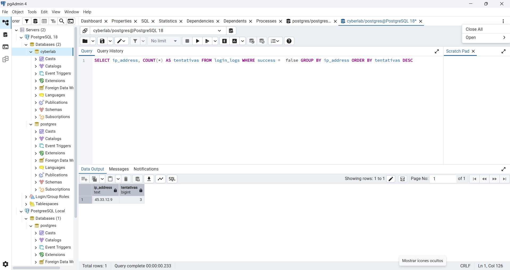
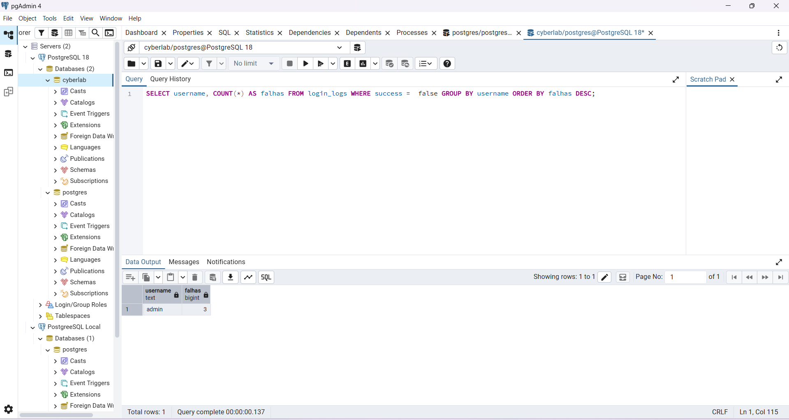
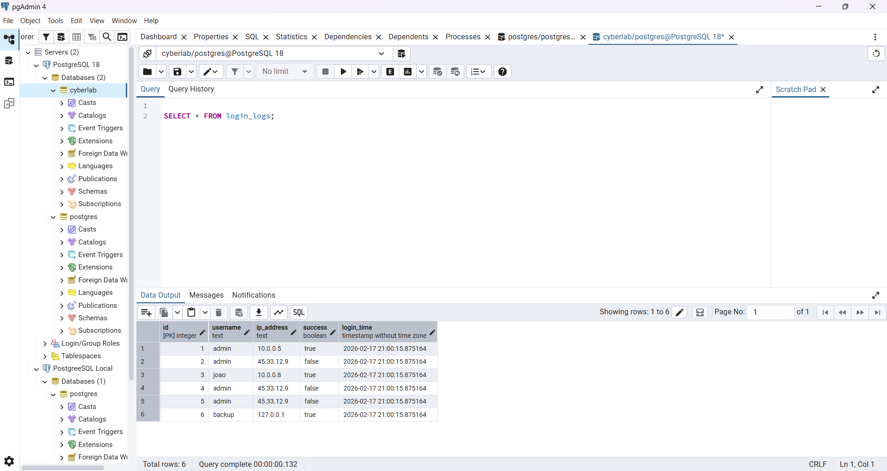
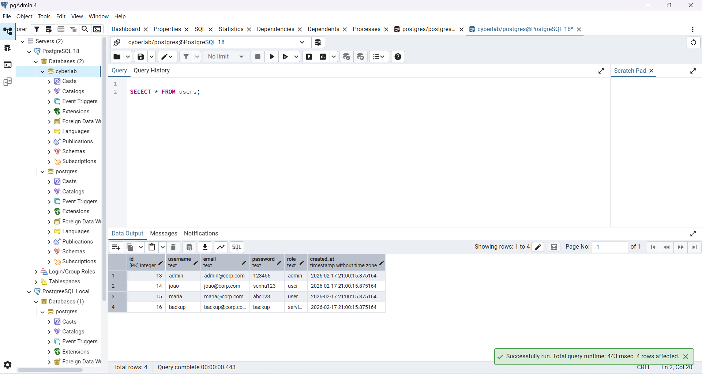
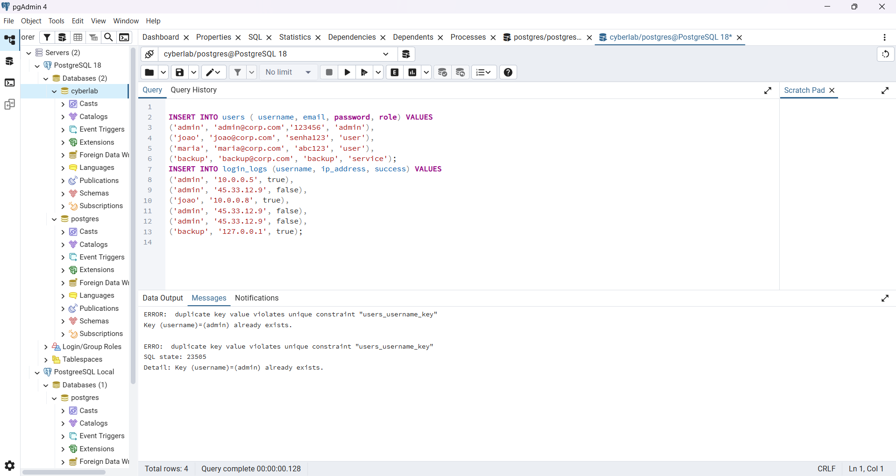
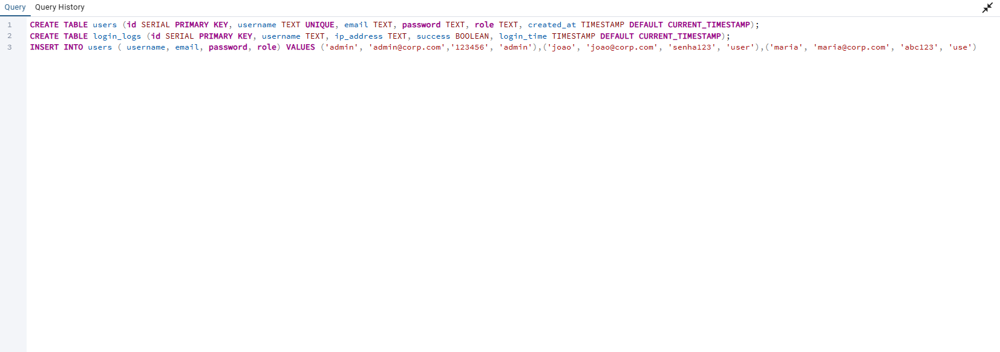
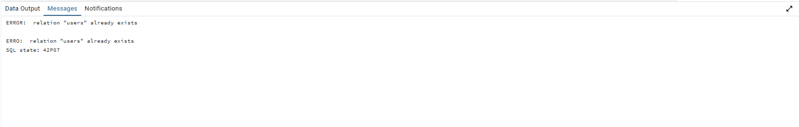
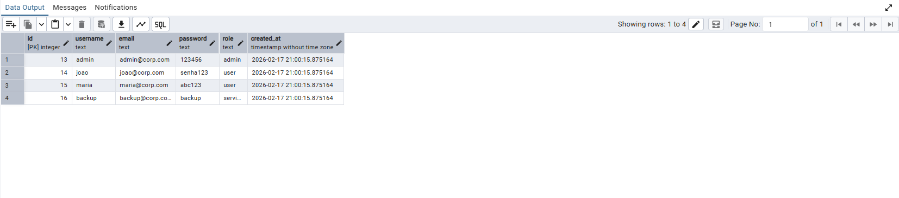
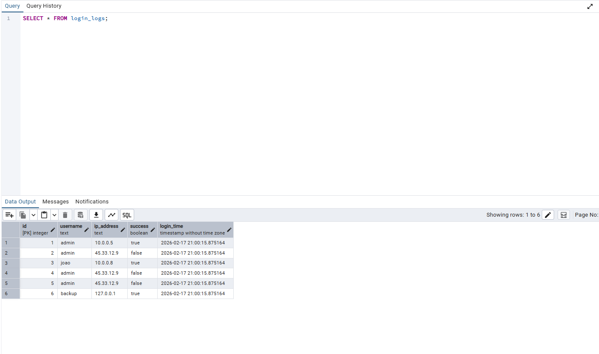
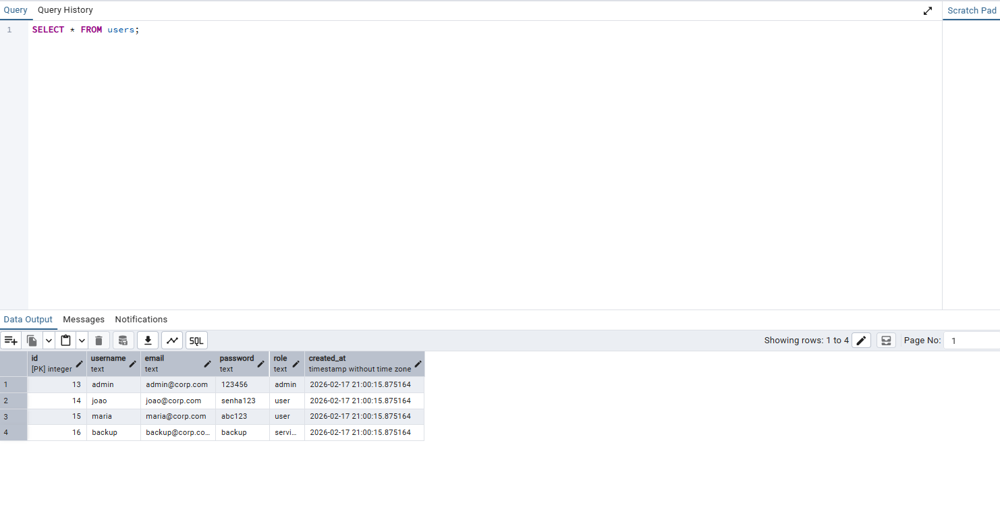
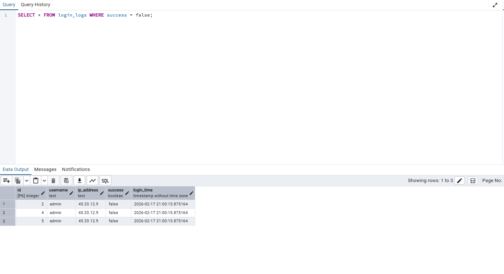
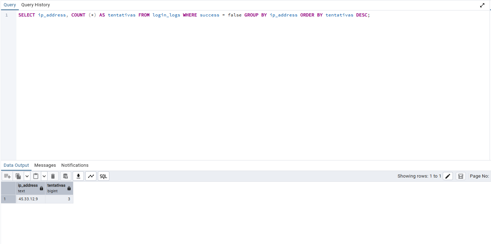
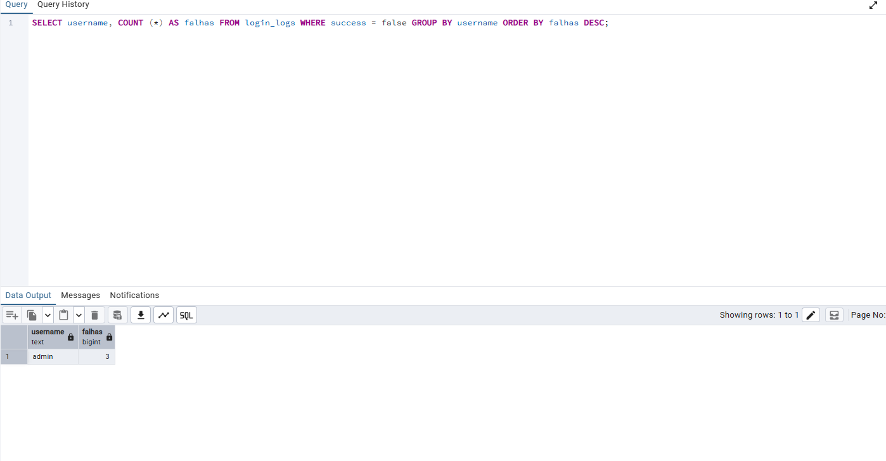
